# GoaDirectory modern design previews

Twenty concept previews generated with **Magnific Nano Banana Pro at 1K quality**, using a 16:9 desktop viewport. Each numbered direction contains one homepage and one matching Counto Motors listing-detail concept.

> These are visual direction previews, not final production screenshots. Small wording, map, date, or address artifacts produced by the image model are illustrative only. Implementation will use the audited live content and verified facts in [`AUDIT.md`](AUDIT.md), not text inferred from the preview pixels.

## Recommended shortlist

1. **Goa Atlas (#1)** - Best overall blend of Goa identity, location discovery, search visibility, conversion, and scalable category architecture.
2. **Local First (#4)** - Best for broad accessibility, mobile adaptation, plain-language search, and strong contact conversion.
3. **Search Canvas (#9)** - Best for speed, Core Web Vitals, low implementation risk, and search-led SEO at scale.

**Alternative premium direction:** Heritage Modern (#7) if a more distinctive, crafted Goa identity is preferred over maximum utility density.

## 1. Goa Atlas

**Character:** Cartographic editorial discovery with a strong sense of place. Deep estuary teal, laterite coral, warm sand, Manrope, and Newsreader.

**SEO and UX strategy:** Search-first H1, category and locality links, crawlable area hubs, featured ItemList, compact cards, map used as supporting context rather than blocking content.

| Homepage | Counto Motors listing |
|---|---|
| [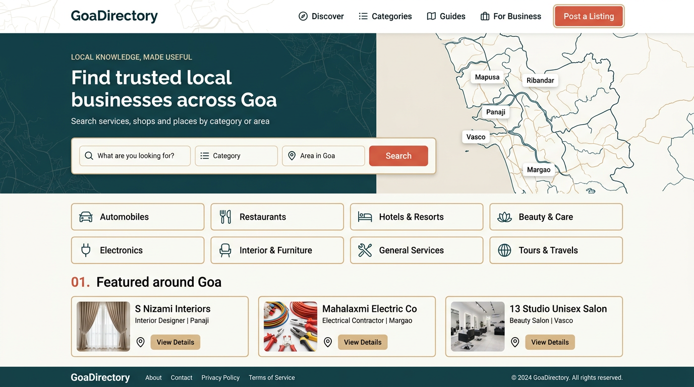](home/01-goa-atlas-home.png) | [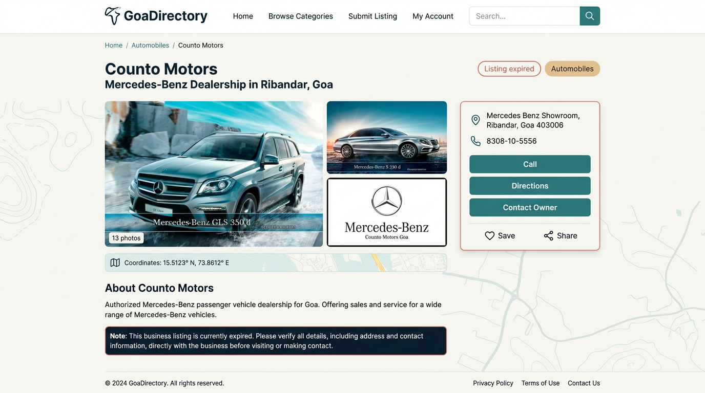](listing/01-goa-atlas-listing.png) |

## 2. Coastal Signal

**Character:** Bold marine-wayfinding utility with midnight navy, aqua, signal orange, and geometric signal markers.

**SEO and UX strategy:** Very strong search prominence, locality crawl links, quick intent links, bento content hierarchy, persistent contact actions on listing pages.

| Homepage | Counto Motors listing |
|---|---|
| [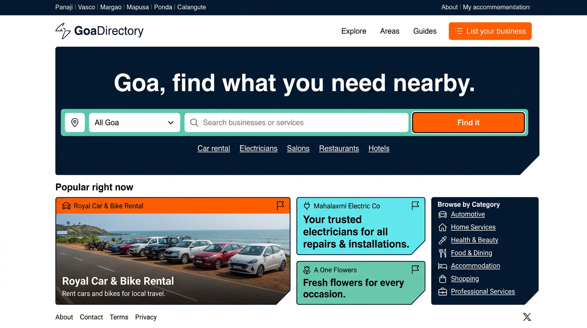](home/02-coastal-signal-home.png) | [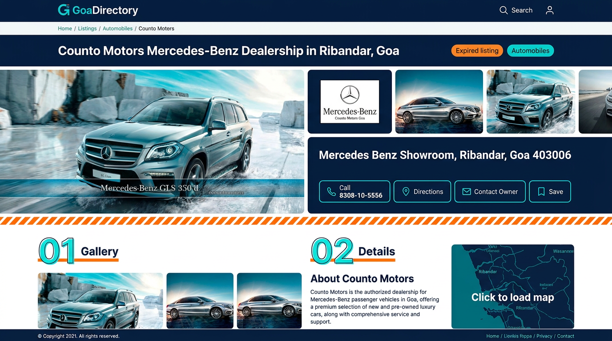](listing/02-coastal-signal-listing.png) |

## 3. Konkan Editorial

**Character:** A warm local magazine with expressive serif typography, paper texture, hairline rules, and story-led discovery.

**SEO and UX strategy:** Strong editorial authority and internal linking, readable category architecture, local-guide potential, structured business facts retained alongside richer content.

| Homepage | Counto Motors listing |
|---|---|
| [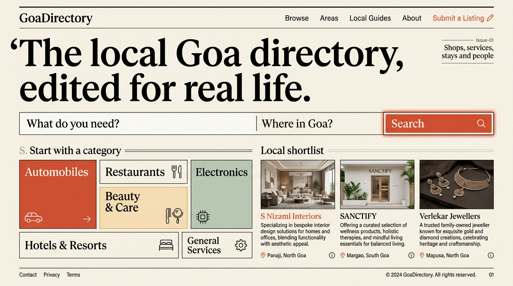](home/03-konkan-editorial-home.png) | [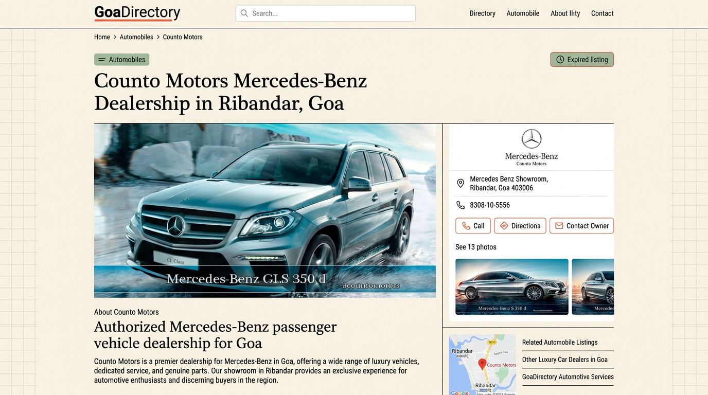](listing/03-konkan-editorial-listing.png) |

## 4. Local First

**Character:** Friendly neighborhood utility with warm cream, forest green, acid-lime action states, thick outlines, and large touch targets.

**SEO and UX strategy:** Plain-language H1 and search labels, intent shortcuts, semantic list layouts, strong expired-listing disclosure, prominent call and directions actions.

| Homepage | Counto Motors listing |
|---|---|
| [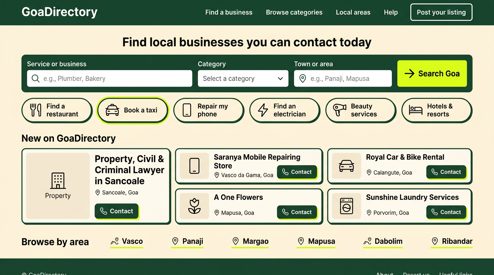](home/04-local-first-home.png) | [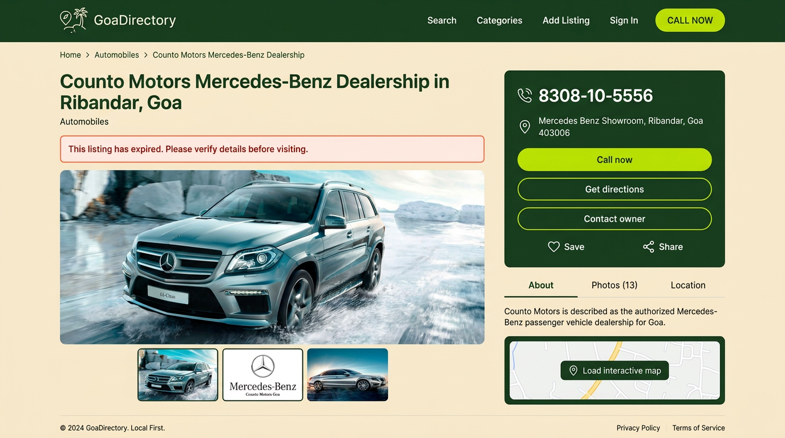](listing/04-local-first-listing.png) |

## 5. Cobalt Directory

**Character:** Structured civic-modern authority using cobalt, midnight, yellow, and strict Swiss grid logic.

**SEO and UX strategy:** Excellent information density, crawlable indexed categories, clean metadata hierarchy, stable media areas, highly structured listing facts.

| Homepage | Counto Motors listing |
|---|---|
| [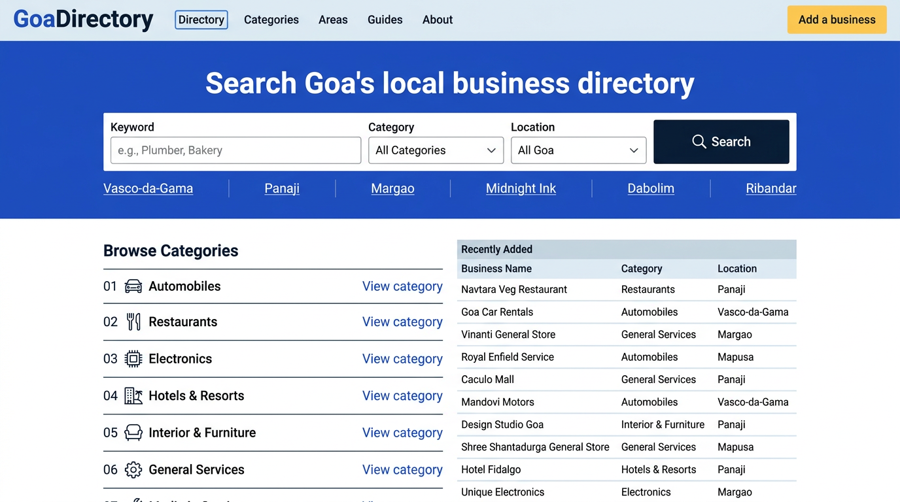](home/05-cobalt-directory-home.png) | [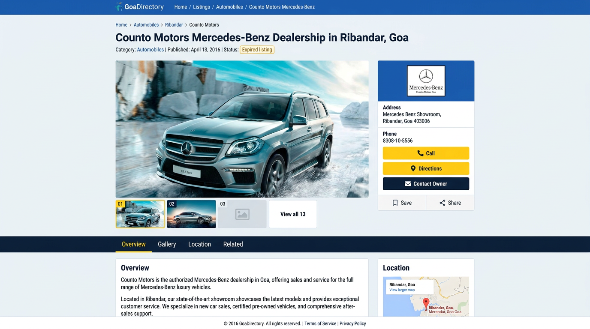](listing/05-cobalt-directory-listing.png) |

## 6. Market Map

**Character:** Spatial-first exploration with parchment, cartographic blue, coral pins, and synchronized map/results layouts.

**SEO and UX strategy:** Local-area discovery is central, while all business results remain semantic HTML links. Static map previews protect LCP and load interactive maps only on demand.

| Homepage | Counto Motors listing |
|---|---|
| [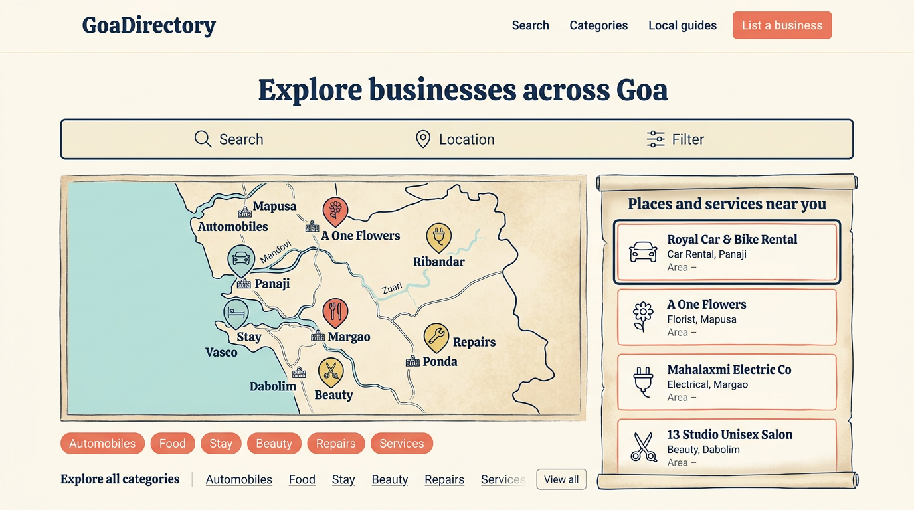](home/06-market-map-home.png) | [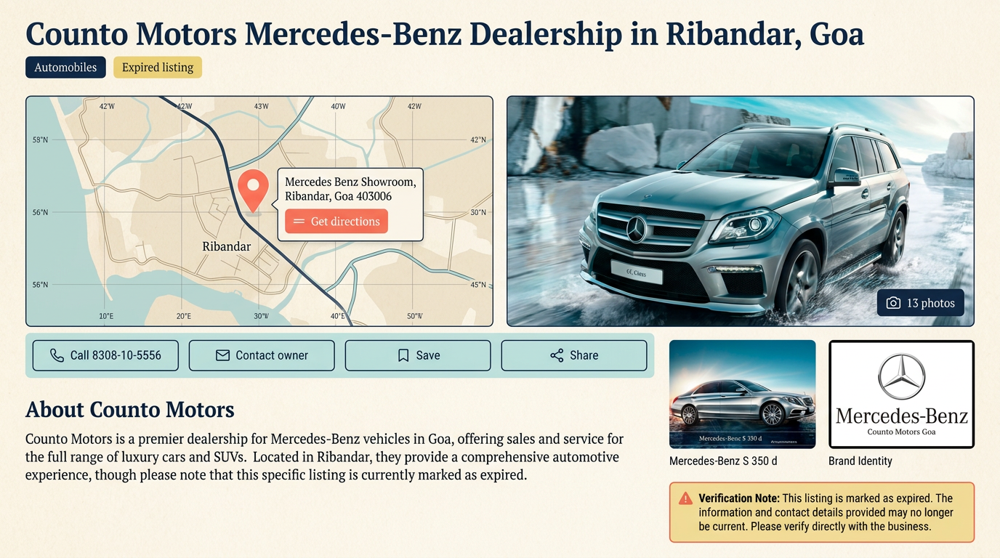](listing/06-market-map-listing.png) |

## 7. Heritage Modern

**Character:** Contemporary Goan craft cues, architectural rhythm, restrained tile geometry, ivory, deep teal, laterite, and brass.

**SEO and UX strategy:** Strong branded search identity, clear search form, curated category hubs, descriptive business cards, scannable LocalBusiness facts and gallery.

| Homepage | Counto Motors listing |
|---|---|
| [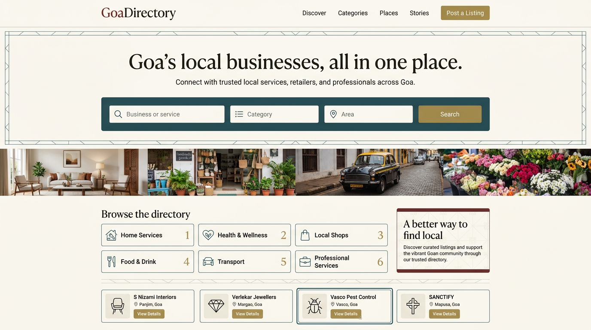](home/07-heritage-modern-home.png) | [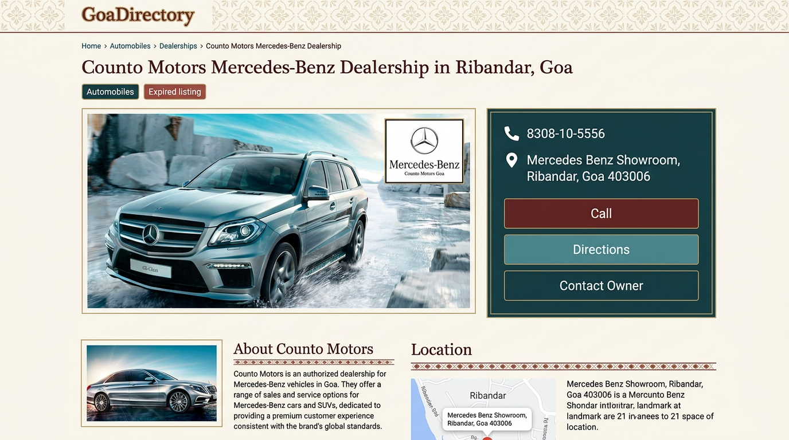](listing/07-heritage-modern-listing.png) |

## 8. Night Bazaar

**Character:** Premium accessible dark mode using graphite, luminous lime, orange, and editorial bento composition.

**SEO and UX strategy:** High-contrast search and action hierarchy, semantic content under visual tiles, no fake open-now states, stable image dimensions, reduced-motion compatible.

| Homepage | Counto Motors listing |
|---|---|
| [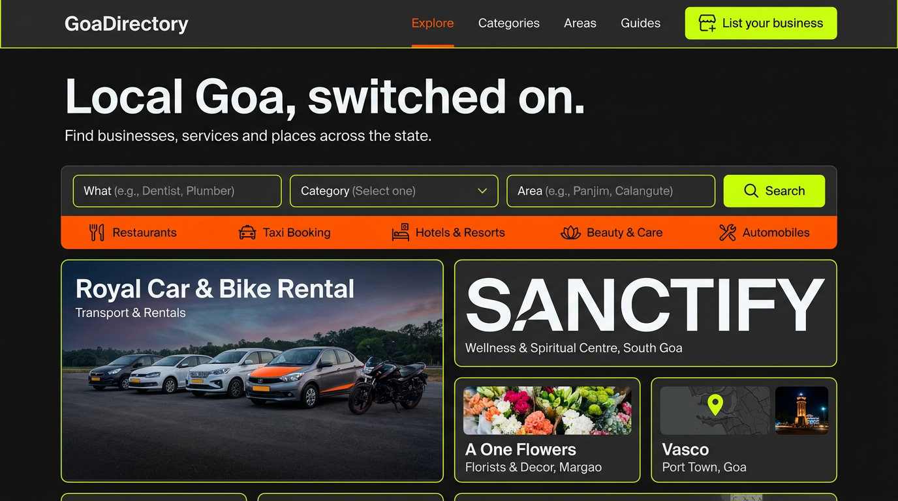](home/08-night-bazaar-home.png) | [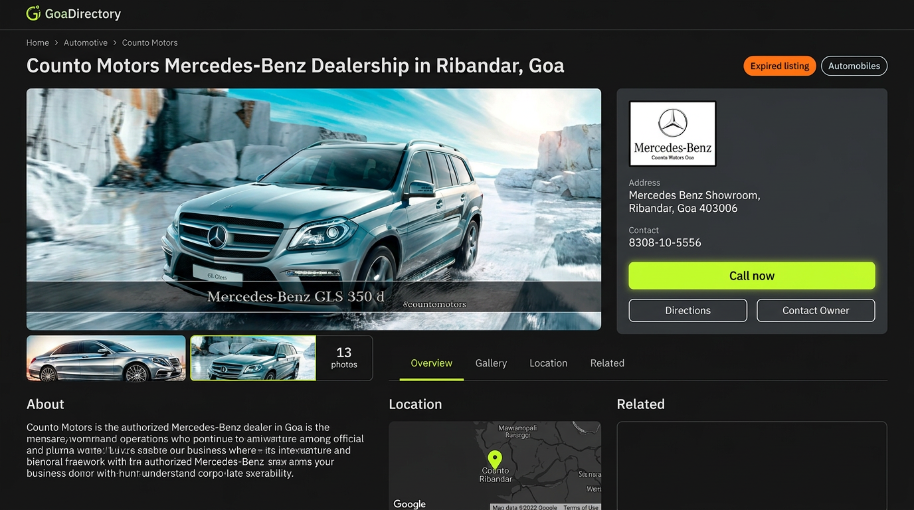](listing/08-night-bazaar-listing.png) |

## 9. Search Canvas

**Character:** Ultra-minimal search dominance with a white canvas, near-black text, pure blue actions, and calm progressive disclosure.

**SEO and UX strategy:** Fastest likely LCP, minimal layout shift, one dominant search task, simple HTML category index, large listing gallery, and direct contact rail.

| Homepage | Counto Motors listing |
|---|---|
| [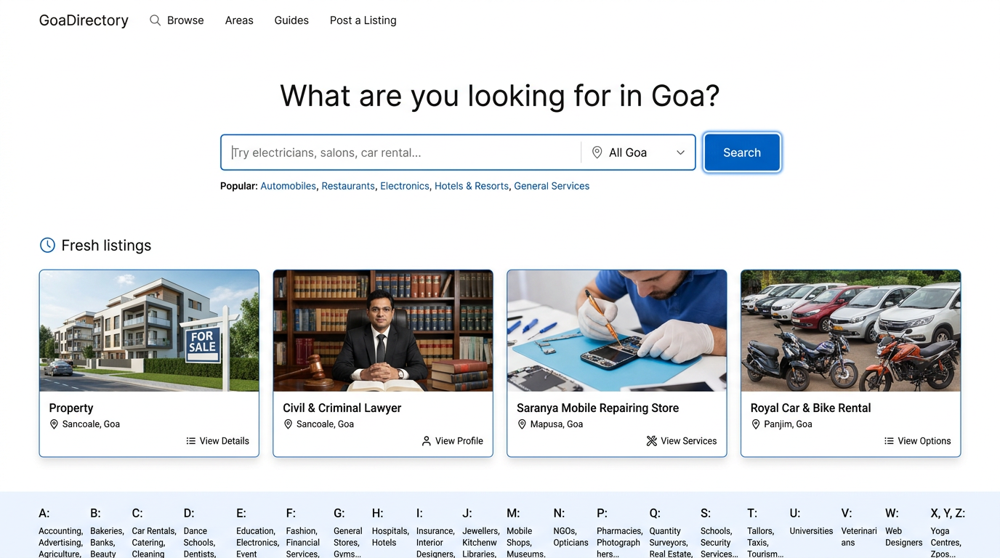](home/09-search-canvas-home.png) | [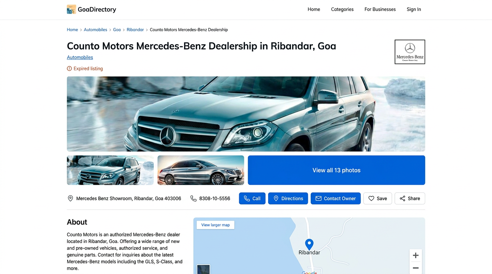](listing/09-search-canvas-listing.png) |

## 10. Trusted Goa

**Character:** Mature assurance-led design with deep forest, warm ivory, muted gold, and transparent business status presentation.

**SEO and UX strategy:** Search intent plus essential category links, trust through explicit data fields, honest listing status, accessible action order, and strong LocalBusiness schema mapping.

| Homepage | Counto Motors listing |
|---|---|
| [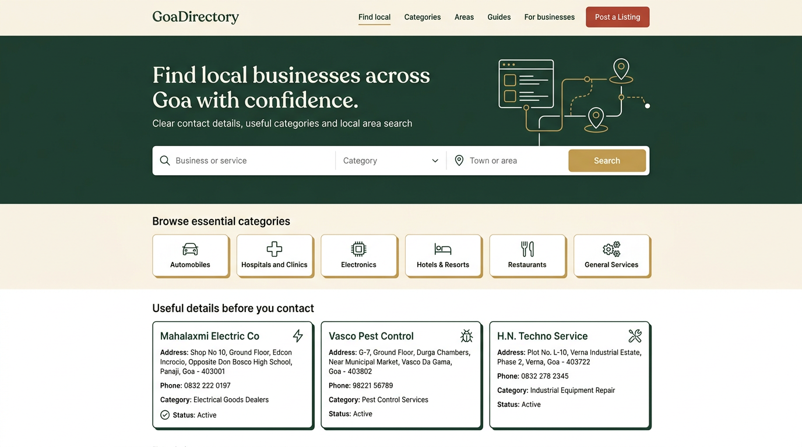](home/10-trusted-goa-home.png) | [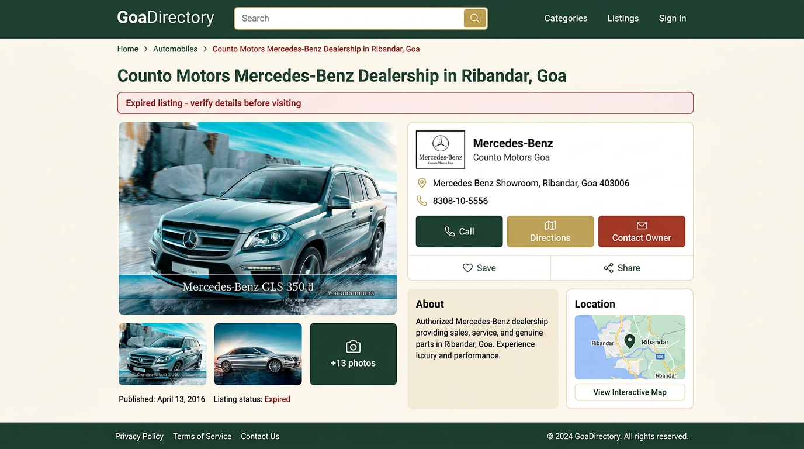](listing/10-trusted-goa-listing.png) |

## Shared production SEO specification

### Homepage

- One indexable H1 focused on finding local businesses in Goa.
- Native HTML search form with keyword, category, and locality fields.
- Crawlable category and locality hubs, not JavaScript-only filtering.
- `WebSite` with `SearchAction`, `Organization`, `WebPage`, and `ItemList` structured data.
- Purpose-built Open Graph image and accurate metadata.
- Editorial guides and related category links for topical authority.

### Listing detail

- One H1: business name, service/category, and location.
- `LocalBusiness` or the most accurate subtype, plus `PostalAddress`, `BreadcrumbList`, `ImageObject`, and `WebPage` schema.
- No `Offer` schema unless a real priced offer exists. Never map a phone number to price fields.
- Descriptive gallery alt text, reserved image dimensions, and lazy loading below the LCP image.
- Scannable About, Gallery, Location, and Related sections.
- Call, Directions, Contact, Save, and Share controls with accessible labels.
- Honest expired/verification status. No invented reviews, ratings, hours, prices, or badges.

### Accessibility and Core Web Vitals

- WCAG 2.2 AA contrast and visible keyboard focus.
- Minimum 44 px touch targets and semantic landmarks.
- LCP target under 2.5 seconds, CLS under 0.1, INP under 200 ms.
- Responsive images, local/subset fonts, and no carousel as the homepage LCP.
- Static map preview with click-to-load interactive map.
- Server-rendered primary content so listings remain crawlable without JavaScript.

## Supporting files

- [`AUDIT.md`](AUDIT.md) - current live-page content and SEO findings
- [`prompts.json`](prompts.json) - all ten paired design systems and generation prompts
- [`manifest.json`](manifest.json) - model, resolution, dimensions, hashes, and completion record for all twenty images
- [`MAGNIFIC-API.md`](MAGNIFIC-API.md) - verified official API workflow and source links
